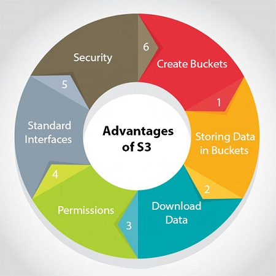
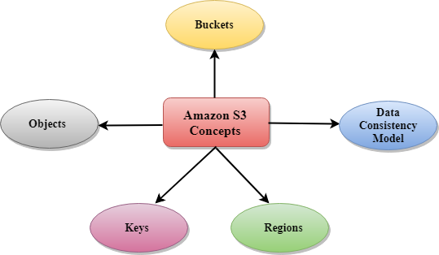

### AWS Storage Services
<ul>
<li> Basic Stoarge Concepts 
<li> AWS Simple Storage Services (AWS S3)
<li> AWS Elastic Block Store (AWS EBS)
<li> AWS Elastic File System (AWS EFS)
<li> Storage Solutions
</ul>

<hr>

#### What are Instance Store ?
<ul>
<li> Instance Store is a storage volume that acts as a physical hard drive.
<li>It provides temporary storage for Amazon EC2 instance.
<li>The data in an instance store persists during the lifetime of its instance.
<li>If an instance reboots, data in the instance store will persist.
<li>When the instance hibernates or terminates, you lose any data in the instance store.
</ul>

#### AWS S3 (Simple Storage Services)
<ul>
<li> S3 is one of the first services that has been produced by aws.
<li> S3 provides developers and IT teams with secure, durable, highly scalable object storage.
<li> It is easy to use with a simple web services interface to store and retrieve any amount of data from anywhere on the web.
<li> It is Object-based storage, i.e., you can store the images, word files, pdf files, etc. The files which are stored in S3 can be from 0 Bytes to 5 TB.
<li> S3 is a universal namespace, i.e., the names must be unique globally. Bucket contains a DNS address. Therefore, the bucket must contain a unique name to generate a unique DNS address.
</ul>
``` You can create only 100 buckets on a single AWS account.```


#### Advantages of AWS S3

- Create Buckets
- Storing data in buckets
- Download data
- Permissions
- Standard interfaces
- Security
- S3 is a simple key-value store

#### AWS S3 Concepts
