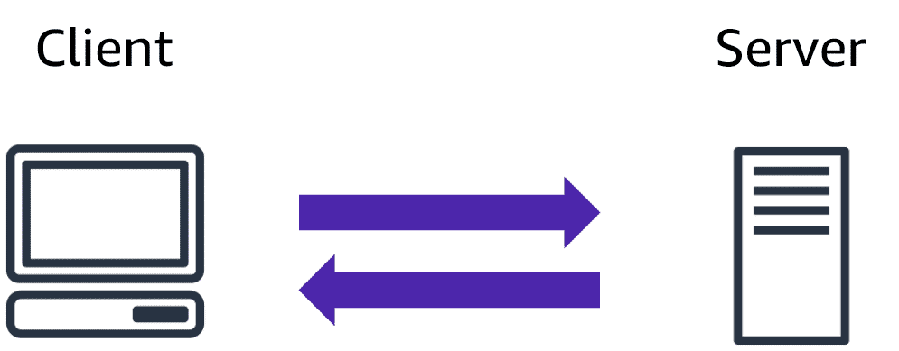
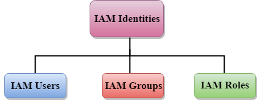

<h3 style="color: brown; font-family:courier">  This AWS tutorial will give and overview of the AWS cloud. It will cover the topics like AWS security,architecture and pricing which is also the syallabus of AWS Certified Cloud Practitioner Exam.
<br/>
<h3> What is AWS Cloud ? </h3>
<ul>
<li><p> <b> AWS i.e Amazon Web Services is a cloud computing platform, 
which was started in 2006 by it's first product S3 i.e Simple Storage 
Services. And till date it's the largest cloud provider in the world.
</b>
<li><p><b>The AWS service is provided by the Amazon that uses distributed IT infrastructure to provide different IT resources available on demand. It provides different services such as infrastructure as a service (IaaS), platform as a service (PaaS) and packaged software as a service (SaaS).</b>
<li><p> <i> To practice your AWS concepts or to get practical 
experience that how it works, you can create a AWS Free Tier 
account which is absolutely free for 1 year and you can use 
all the basic services of AWS in it. </i>
</ul>
<hr>
<h3> Uses of AWS
<ul>
<li> A small manufacturing organization uses their expertise to expand their business by leaving their IT management to the AWS.
<li> A large enterprise spread across the globe can utilize the AWS to deliver the training to the distributed workforce.
<li> An architecture consulting company can use AWS to get the high-compute rendering of construction prototype.
<li> A media company can use the AWS to provide different types of content such as ebox or audio files to the worldwide files.
</ul>

----------

## AWS Cloud Computing
* The Client Model:- 
    * It is about many clients using services from a centralized server.
    * The client server model is about a client that intercats and makes request to a computer server.
    - A client is the way that the person interact with the server. The server does tasks for the client and returns information.
* The following image will give you and idea about Client-Server Model:-

----------

### What is Cloud Computing ?
* A computing service made available over the internet.
* Is a pay-as-you-go model for delivering IT resources.
----------
### Advantages of AWS
- Flexibility
- Cost-effective
- Scalability/ Elasticity
- Security
----------
``` History of AWS:- ```


----------

#### AWS Global Infrastructure:-
- Global infrastructure is a region around the world in which AWS is based.
- AWS is available in 19 regions and 57 availability zones in December 2018 and 5 more regions 15 more availability zones for 2019.
- AWS infrastructure can be observed as below:-
    - 

##### Availability zone as Data Center:-
- An availability zone is a facility that can be somewhere in a country or in a city.
- We can have multiple servers, switches, load balancing, firewalls. The things which interact with the cloud sits inside the data centers.
- An availability zone can be a several data centers, but if they are close together, they are counted as 1 availability zone.

##### Region
- A region is a geographical area. Each region consists of 2 more availability zones.
- A region is a collection of data centers which are completely isolated from other regions.
- A region consists of more than two availability zones connected to each other through links.

##### Edge Locations
- Edge locations are the endpoints for AWS used for caching content.
- Edge locations consist of CloudFront, Amazon's Content Delivery Network.
- Edge location are more than regions. Currently, there are over 150 edge locations.
- Edge location is not a region but a small location that AWS have. It is used for caching the content.
- Edge location are mainly located in most of the major cities to distribute the content to end users with reduced latency.

##### Regional Edge Cache
- AWS announced a ned type of edge location in November 2016, known as a Regional Edge Cache.
- Regional Edge cache lies between CloudFront Origin servers and the edge locations.
- A regional edge cache has a large cache than an indivial edge location.
- Data is removed from the cache at the edge location while the data is retained at the Regional Edge Caches.
- When the user requests the data, then data is no longer available at the edge location. Therefore, the edge location retrieves the cached data from the Regional edge cache instead of the Origin servers that have high latency.

----------

#### What is IAM ?
<ul>
<li> IAM stands for <i>"Identity Access Management"</i>.
<li> It allows you to manage users and their level of acess to the aws console.
<li> It is used to set users, permissions and roles. It allows you to grant access to the different parts of the aws platform.
<li> With IAM, Organizations can centrally manage users, security credentials such as access keys, and permissions that control which AWS resources users can access.
<li> IAM enables the organization to create multiple users, each with its own security credentials, controlled and billed to a single aws account. IAM allows the user to do only what they need to do as a part of the user's job.
</ul>

#### Features of IAM:-
<ul>
<li> Centralised control of your AWS account
<li> Shared Access to your AWS account
<li>Granular permissions
<li>Identity Federation
<li>Multifactor Authentication
<li>Permissions based on Organizational groups
<li>Networking controls
<li>Provide temporary access for users/devices and services where necessary
<li>Integrates with many different aws services
<li>Supports PCI DSS Compliance
<li>Eventually Consistent
<li>Free to use
</ul>


#### IAM Identities
 
- IAM Users
- IAM Groups
- IAM Roles


