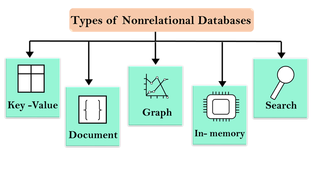

<h3 style="color:brown;">AWS NonRelational Database</h3>

<ul>
<li>
NonRelational Database is a database that does not follow the relational database model provided by the relational database management system.
</li>
</ul>

<h4>Key features of NonRelational Database</h4>
<ul>
<li><b>Flexibility</b></li>
<li><b>Scalability</b></li>
<li><b>High-performance</b></li>
<li><b>Highly functional</b></li>
</ul>

</img>

