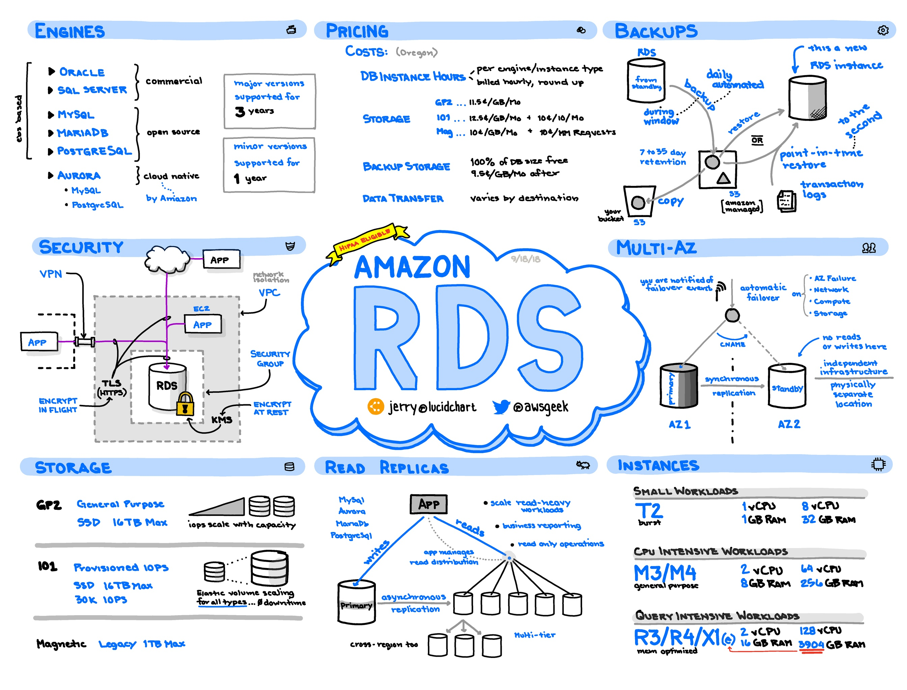

<h3 style="color:brown;">AWS RDS</h3>

``` AWS RDS i.e. AWS Relational Databases services.```
<hr>
<h5>What is a Relational Database?</h5>
<ul>
<li><p>A relational database is a type of database that organizes data into one or more tables or relations, with each table consisting of a set of rows and columns.</p></li>
<li><p> In a relational database, the data is stored in a structured format, with each row representing a unique record and each column representing a specific attribute or piece of data related to that record.</p></li>
<li><p>The relationships between the tables in a relational database are defined by common fields or keys, which are used to link the tables together. For example, in a database for an online store, there might be separate tables for customers, orders, and products, with a common key linking each order to a specific customer and product.</p></li>

<li><p>Relational Database provides following advantages over other type of databses:- </p>
<ul>
<li><p><b>Data integrity:-</b>Relational databases use strict rules for data validation and integrity, which helps to ensure that the data is accurate and consistent.</p></li>
<li><p><b>Querying flexibility:-</b>With SQL, the standard language used for querying relational databases, it's easy to retrieve and analyze data from multiple tables and create complex queries.</p></li>
<li><p><b>Scalability:-</b>Are highly scalable, allowing them to handle large amounts of data and grow as your business needs change.</p></li>
<li><p><b>Security:-</b> Offer several security features, such as user authentication, access controls, and data encryption.</p></li>
</ul>
</li>
<li><p>Examples of popular relational database management systems (RDBMS) include <b>Oracle, MySQL, Microsoft SQL Server, PostgreSQL, and SQLite.</b></p></li>
</ul>

<hr>

<h3>RDS Aurora</h3>
<ul>
<li>Aurora is a cloud only database service designed to provide a distributed, fault-tolerant relational database with self-healing storage and auto-scaling up to 64TB per instance.</li>
<li>It currently comes in two versions, a MySQL compatible system, and a PostgreSQL compatible system.</li>
</ul>

<hr>
<h3>RDS MySQL</h3>
<ul>
<li>Amazon RDS supports the popular open-source MySQL database, which is widely used for web applications and other data-intensive workloads.</li>
<li>Amazon RDS provides fully managed MySQL instances with features like automatic backups, automated software patching, and read replicas for scaling read-heavy workloads.</li>
</ul>

<hr>
<h3>RDS PostgreSQL</h3>
<ul>
<li>Amazon RDS also supports PostgreSQL, a powerful open-source relational database that offers advanced features like JSON support, full-text search, and geospatial indexing.</li>
<li>Amazon RDS for PostgreSQL provides features like automated backups, automatic software patching, and read replicas for scaling read-heavy workloads.</li>
</ul>

<hr>
<h3>Oracle</h3>
<ul>
<li>Amazon RDS supports Oracle Database, a powerful enterprise-grade relational database that is widely used for mission-critical workloads.</li>
<li>Amazon RDS for Oracle provides features like automated backups, automatic software patching, and read replicas for scaling read-heavy workloads.</li>
</ul>

<hr>
<h3>Microsoft SQL Server</h3>
<ul>
<li>Amazon RDS supports Microsoft SQL Server, a widely used relational database in the enterprise.</li>
<li>Amazon RDS for SQL Server provides features like automated backups, automated software patching, and read replicas for scaling read-heavy workloads.</li>
</ul>

<hr>
<h3>MariaDB</h3>
<ul>
<li>Amazon RDS supports MariaDB, a popular open-source fork of MySQL that offers improved performance and additional features like non-blocking backups and online schema changes.</li>
<li>Amazon RDS for MariaDB provides features like automated backups, automated software patching, and read replicas for scaling read-heavy workloads.</li>
</ul>

<hr>

</img>

<hr>
