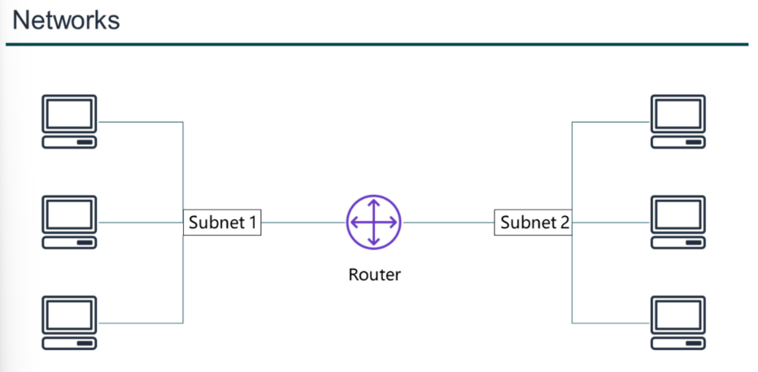
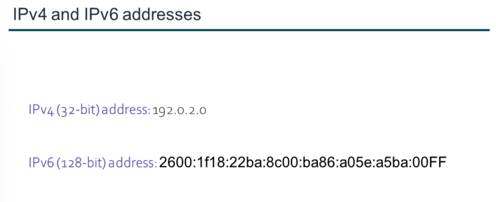
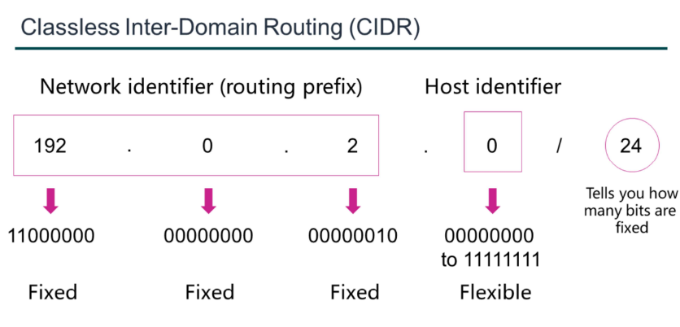
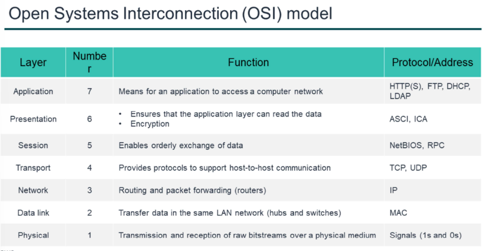

<h3>Networking Basics</h3>
<ul>
<li>
A computer network is two or more client machines that are connected together to share resources.
</li>
<li>
A network can be logically partitioned into subnets.
</li>
<li>
Networking requires a networking device (such as a router or switch) to connect all the clients together and
enable communication between them.
</li>
<li>

</li>
</ul>

<ul>
<li>
Each client machine in a network has a unique Internet Protocol (IP) address that identifies
it.
</li>
<li>
An IP address is a numerical label in decimal format. Machines convert that decimal number to a binary format.
</li>
<li>
A 32-bit IP address is called an IPv4 address. and IPv6 has 128 bits.
</li>
<li>
 
</li>
</ul>

<ul>
<li>
A common method to describe networks is Classless Inter-Domain Routing (CIDR). The CIDR address is expressed as follows:- 

<ul>
<li>
An IP address(which is the first address of the network.
</li>
<li>
Next, a slash character (/).
</li>
<li>
At last, a number that tells you how many bits of the routing prefix must be fixed or allocated for the network identifier.
</li>
</ul>
</li>
<li>
The bits that are not fixed are allowed to change. CIDR is a way to express a group of IP addresses that are consecutive to each other.
</li>
<li>
In this example, the CIDR address is 192.0.2.0/24. The last number (24) tells you that the
first 24 bits must be fixed. The last 8 bits are flexible, which means that 28 (or 256) IP addresses are available for the network, which range from 192.0.2.0 to 192.0.2.255. The
fourth decimal digit is allowed to change from 0 to 255.
</li>
<li> </li>
</ul>

<ul>
<li> </li>
<li>
Also have a look on the OSI model, it can also be used to understand how communication takes place in a virtual private cloud(VPC).
</li>
</ul>

